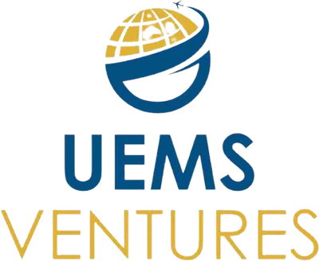
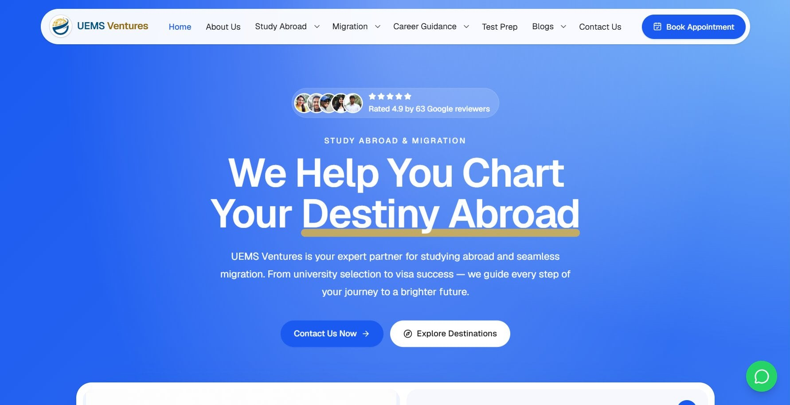
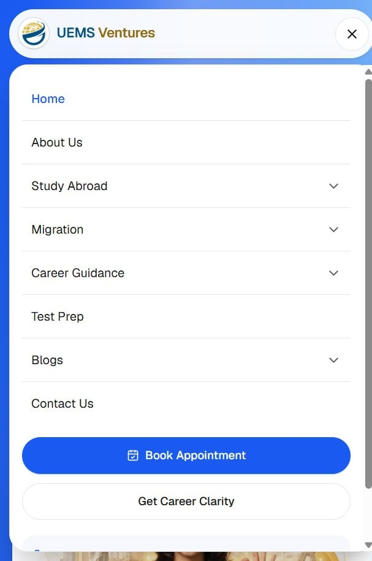
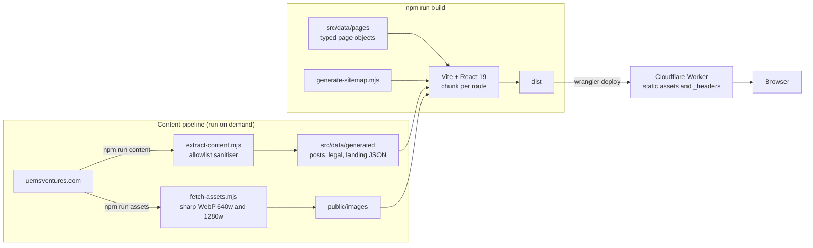
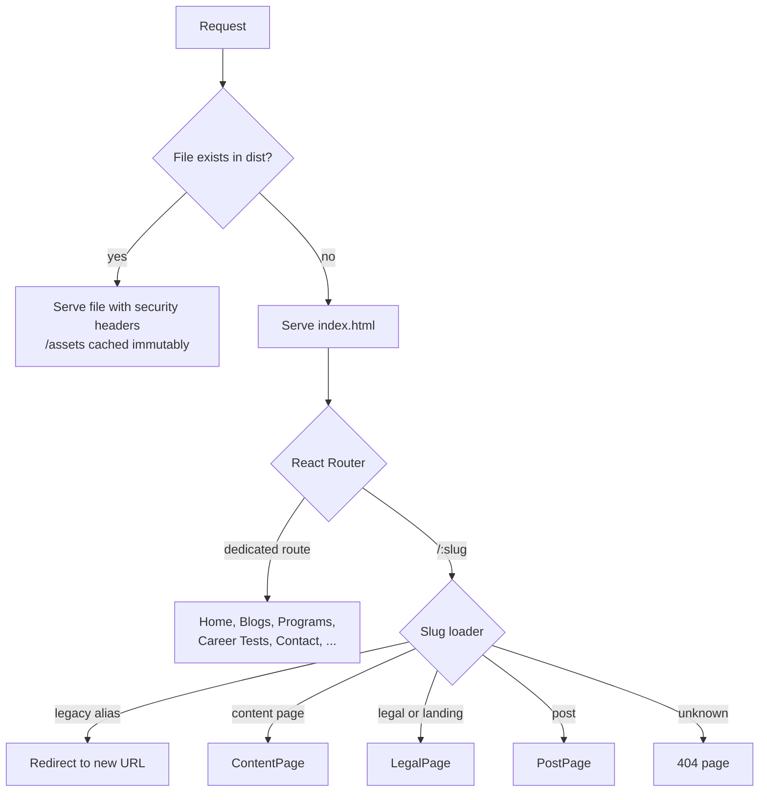
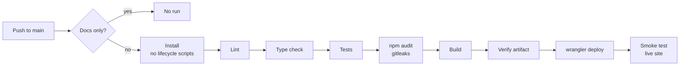

<div align="center">

<a href="https://uems-pulse.spacesdrive.cc">
  
</a>

<h1>UEMS Pulse</h1>

<p><strong>A fast, accessible, content-driven website for UEMS Ventures,<br />a Mumbai consultancy for study abroad, migration and career guidance.</strong></p>

<p>
  <a href="https://github.com/spacesdrive/uems-pulse/actions/workflows/ci-cd.yml"></a>
  <a href="https://uems-pulse.spacesdrive.cc"></a>
  <a href="https://react.dev"></a>
  <a href="https://www.typescriptlang.org"></a>
  <a href="https://tailwindcss.com"></a>
  <a href="https://developers.cloudflare.com/workers/static-assets/"></a>
</p>

<p>
  <a href="https://uems-pulse.spacesdrive.cc"><strong>Live site</strong></a>
  &nbsp;&bull;&nbsp;
  <a href="#quick-start">Quick start</a>
  &nbsp;&bull;&nbsp;
  <a href="#architecture">Architecture</a>
  &nbsp;&bull;&nbsp;
  <a href="docs/DEPLOYMENT.md">Deployment guide</a>
  &nbsp;&bull;&nbsp;
  <a href="https://github.com/spacesdrive/uems-pulse/issues">Report an issue</a>
</p>



</div>

## About

UEMS Pulse rebuilds the website of [UEMS Ventures](https://uemsventures.com) (Unique Education and Migration Services) as a modern single-page application. It carries over the original site's pages, posts and URL structure, and presents them in a new visual language.

It has no application server and no database. Every page, blog post and legal notice is typed data compiled into the build, and every image is an optimised local WebP. The result is served as static assets from Cloudflare's edge network.

## Why UEMS Pulse

The original site runs on WordPress with a page builder. Consultancy content changes rarely, yet every visit still depends on a database, a PHP server and pages assembled on request. UEMS Pulse keeps the content and removes the stack.

- **Content stays the same.** Posts, news, legal pages and SEO landing pages are extracted from the live site into JSON, so nothing is lost or rewritten by hand.
- **Old URLs keep working.** Top-level slugs match the original scheme, and legacy aliases such as `/usa` or `/inquiry` redirect to their new pages.
- **Nothing to run.** With no server or database, there is nothing to patch, back up or scale.
- **Quality is enforced.** Linting, type checks, 74 automated tests, security scans and a post-deploy smoke test run on every code change.

## Features

| Feature | Details |
| :-- | :-- |
| **Complete content** | 20 service and destination pages, 25 blog and event posts, 7 SEO landing pages, legal pages and category archives. The sitemap lists 67 URLs. |
| **Data-driven pages** | Pages are plain TypeScript objects built from 17 typed section kinds (`features`, `table`, `steps`, `faq`, `team`, `pricing`, and more). |
| **Per-page code splitting** | Every route, content page and post body is its own chunk, so a visit downloads only what it shows. |
| **Optimised imagery** | Source images are converted to 640w and 1280w WebP with `srcset`. Lazy loading is the default, and missing files render a branded placeholder. |
| **Enquiry flow** | An accessible, validated form opens a pre-filled email to the team, with WhatsApp offered as an instant alternative. |
| **Interactive tools** | A destination explorer, curriculum quizzes in a native `<dialog>`, animated statistics and university logo marquees. |
| **Accessible by design** | Skip link, visible focus styles, labelled form errors, ARIA-wired accordions and tabs, `inert` off-screen menus, and support for reduced motion. |
| **SEO** | Per-page titles, descriptions and Open Graph tags, plus a generated `sitemap.xml` and `robots.txt`. |
| **Hardened delivery** | A strict hash-based Content Security Policy, HSTS, frame blocking and immutable caching for hashed bundles. |

## Screenshots

<table>
  <tr>
    <td width="66%"></td>
    <td width="17%"></td>
    <td width="17%"></td>
  </tr>
  <tr>
    <td align="center">Destination page</td>
    <td align="center">Mobile home</td>
    <td align="center">Mobile menu</td>
  </tr>
</table>

## Quick start

You need [Node.js](https://nodejs.org) 22 or later (see [`.nvmrc`](.nvmrc)).

```bash
git clone https://github.com/spacesdrive/uems-pulse.git
cd uems-pulse
npm ci
npm run dev
```

Open http://localhost:5173. The site runs entirely from the repository, with no environment variables or external services.

## Architecture

### Overview

Content is extracted from the original site once and committed. After that, the build is fully self-contained and ships static files to Cloudflare.



### Request routing

The Worker serves real files directly. Any other path falls back to the application shell, and the client router resolves it.



### Project structure

```text
src/
├── pages/        Route modules, each lazily loaded
├── layouts/      RootLayout, Header, Footer
├── sections/     Page sections rendered from typed data (and home/ for the homepage)
├── components/   Reusable UI such as Img, ContactForm, Accordion and QuizDialog
├── data/         All copy and structured content
│   ├── pages/      One file per data-driven page
│   └── generated/  Extracted posts, legal and landing pages (do not edit by hand)
├── hooks/        Shared scroll-reveal observer
├── lib/          Image URL mapping, icon registry, link helpers
└── styles/       Tailwind v4 theme tokens and component classes
tests/            Unit, component and integration suites
scripts/          Content and asset pipelines, sitemap, artifact checks, smoke test
```

## Adding a page

Most inner pages are data. Create `src/data/pages/<slug>.ts` and export a `ContentPageData` object. The page is served at `/<slug>`, gets its own chunk and joins the sitemap automatically.

```ts
import type { ContentPageData } from '../types';

const page: ContentPageData = {
  slug: 'study-in-uae',
  seo: { title: 'Study in UAE', description: 'Branch campuses, costs and the UAE student visa.' },
  hero: { badge: 'Study in UAE', title: 'Your Gateway to Global Success', highlight: 'Global Success' },
  sections: [
    { kind: 'features', title: 'Why Dubai?', items: [{ icon: 'building', title: 'World-class campuses', text: '...' }] },
    { kind: 'faq', title: 'Questions', items: [{ q: 'Is Dubai safe for students?', a: '...' }] },
    { kind: 'cta', title: 'Talk to an expert', actions: [{ label: 'Contact us', href: '/contact-us' }] },
  ],
};

export default page;
```

When new content references new image URLs, run `npm run assets` to generate the local WebP files.

## Scripts

| Command | Description |
| :-- | :-- |
| `npm run dev` | Start the Vite dev server on port 5173 |
| `npm run build` | Generate the sitemap, type-check and build to `dist/` |
| `npm run preview:worker` | Serve `dist/` in the local Cloudflare runtime on port 8787, with SPA fallback and headers |
| `npm run lint` | Run ESLint; any warning fails |
| `npm run typecheck` | Run `tsc -b` across app, tests and config |
| `npm test` | Run all tests once (`test:watch` and `test:coverage` are also available) |
| `npm run verify:dist` | Check the build output before deploying |
| `npm run smoke -- <url>` | Smoke-test a deployed site |
| `npm run content` | Re-extract posts, legal and landing pages from the original site |
| `npm run assets` | Download and optimise every image referenced in content |

## Testing

The suite uses [Vitest](https://vitest.dev) and [Testing Library](https://testing-library.com) in jsdom.

| Suite | What it covers |
| :-- | :-- |
| `tests/unit` | Link and image helpers, post indexing, and the HTML sanitiser, including obfuscated `javascript:` links. Content-integrity checks confirm every rendered HTML fragment uses allowlisted tags and safe links, every redirect resolves, and every referenced image exists locally. |
| `tests/components` | Form validation and hand-off, accordion behaviour, link handling, image fallback and SEO tags |
| `tests/integration` | The real route table in a memory router: every page renders one `h1`, posts and redirects resolve, unknown paths show the 404 page, and the mobile menu closes after navigation |

```bash
npm test
```

## Deployment

Every push to `main` that changes the application runs the [CI/CD workflow](.github/workflows/ci-cd.yml). Documentation-only changes skip it. Pull requests run the same checks without deploying.



Deploy credentials are stored as secrets on a GitHub environment that only `main` can use. The deploy token is scoped to Workers deployment on the account and to routes and DNS on the site's own zone, and it expires. The [deployment guide](docs/DEPLOYMENT.md) covers setup, secrets, token rotation and rollback.

## Security

- **Response headers.** A hash-based Content Security Policy with no `unsafe-inline` scripts, plus HSTS, `X-Frame-Options: DENY`, `nosniff`, and referrer and permissions policies ([`public/_headers`](public/_headers)).
- **Safe content.** Extracted HTML keeps only `a`, `strong`, `em` and `br`, links are limited to safe schemes, and tests enforce both rules on every CI run.
- **Supply chain.** Actions are pinned to commit SHAs, dependencies install without lifecycle scripts, registry signatures are verified, and Dependabot proposes updates weekly.
- **Deploy gate.** [`verify-dist.mjs`](scripts/verify-dist.mjs) blocks any build output that contains source maps, credential files or secret-like strings.

If you find a vulnerability, please do not open a public issue; contact the repository owner through their [GitHub profile](https://github.com/spacesdrive) instead.

## Contributing

Contributions are welcome. Content fixes, accessibility improvements and bug reports are all useful.

1. Fork the repository and create a branch: `git checkout -b fix/short-description`.
2. Make your change and run the checks: `npm run lint && npm run typecheck && npm test`.
3. Stage only the files you changed, for example `git add src/data/pages/ielts.ts`.
4. Commit using [Conventional Commits](https://www.conventionalcommits.org) (`feat:`, `fix:`, `docs:` and so on), then open a pull request against `main`.

CI runs on every pull request, so please make sure it passes. Please do not hand-edit files in `src/data/generated/`; regenerate them with `npm run content` instead.

## License

This repository does not include an open-source license. The written content, imagery and branding belong to UEMS Ventures. Please contact the maintainers before reusing any part of the project.

## Acknowledgements

- Content and imagery from [uemsventures.com](https://uemsventures.com)
- Built with [React](https://react.dev), [React Router](https://reactrouter.com), [Vite](https://vite.dev) and [Tailwind CSS](https://tailwindcss.com)
- Icons by [Lucide](https://lucide.dev), and the Geist typeface via [Fontsource](https://fontsource.org/fonts/geist)
- Hosted on [Cloudflare Workers](https://developers.cloudflare.com/workers/static-assets/)
